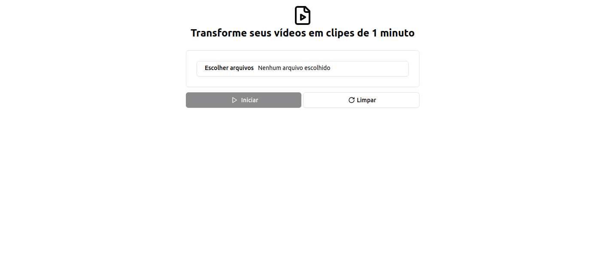
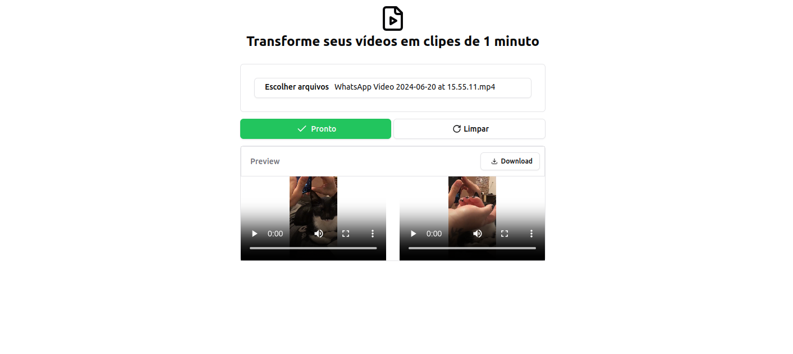

# Transformar vídeos em clipes de 1 minuto

> Esta é uma aplicação para resolver uma dor de um usuário que precisa adicionar stories ao instagram porém precisa ficar editando os vídeos para que fique no tamanho adequado.

  

    
    
  

## 📄 Casos de uso

- Unificar vídeos
- Cortar vídeo geradao em clipes de 1 minuto

## 💡 Padrões abordados

- Como boas práticas e para facilitar a testabilidade do projeto foi utilizado injeção e inversão de dependência.

## 🚀 Melhorias futuras

- [ ] Dividir em componentes
- [ ] Criar testes automatizados

## 💻 Como rodar o projeto

- Node >= 20.13.1
- Gerenciador de pacotes `pnpm`
- Executar `pnpm install` para instalar as dependências
- Executar `pnpm dev` para rodar aplicação
- Acessar `http://localhost:5173/` para acessar aplicação 

## 🌐 Links úteis
[HTML](https://developer.mozilla.org/pt-BR/docs/Web/HTML)
[CSS](https://developer.mozilla.org/pt-BR/docs/Web/css)
[JavaScript](https://developer.mozilla.org/pt-BR/docs/Web/javascript)
[Lucide Icons](https://lucide.dev/)
[React](https://react.dev/)
[Shadcn/ui](https://ui.shadcn.com/)

## 👨‍💻 Tecnologias utilizadas

- HTML
- CSS
- JavaScript
- Lucide (icons)
- Shadcn/ui (lib de componentes)

## 🧑‍💻 Igor Alves Rodrigues

